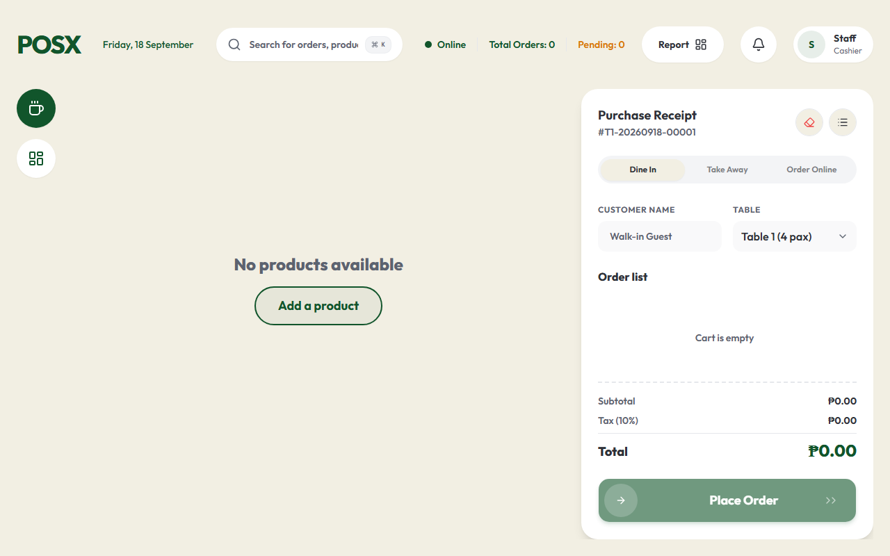
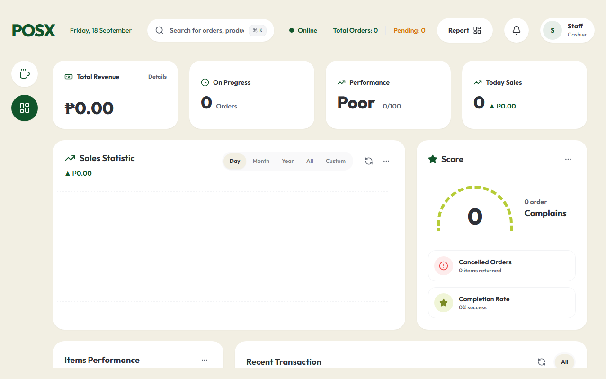
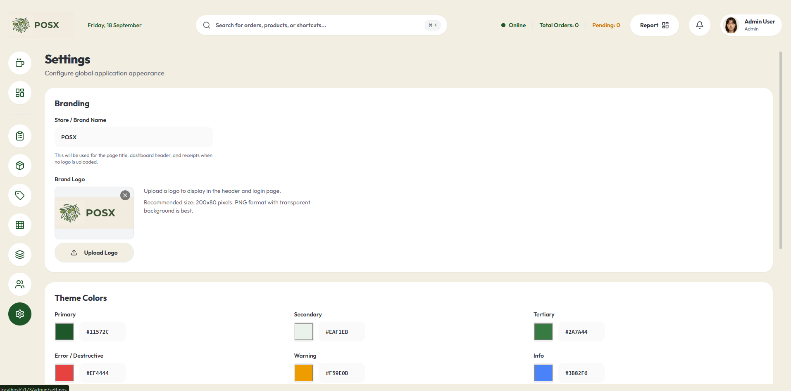
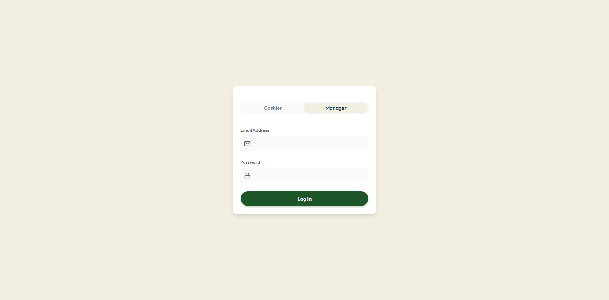

# POSXCAFE POS System

A fast, modern, and **offline-first** Point of Sale (POS) Progressive Web Application (PWA).

<p align="center">
  
  
</p>
<p align="center">
  
  
</p>

---

## 🎯 The Problem It Solves

Modern cafes and retail environments increasingly rely on cloud-based POS systems for centralized management, multi-device syncing, and real-time analytics. However, typical cloud POS systems become sluggish or fail completely when the internet connection drops or becomes unstable. This leads to lost sales, frustrated staff, and a poor customer experience.

**This system solves the "cloud dependency" problem by utilizing a local-first architecture.** It is designed to operate exactly like a traditional, locally-installed POS system when the network goes down, but retains all the benefits of a modern cloud application when connected. Staff can continue ringing up customers, modifying the cart, generating order numbers, and printing receipts without interruption, regardless of internet stability.

## 🌟 Core Capabilities

- **Resilient Offline Mode**: Continue taking orders, browsing the product catalog, and managing the cart even during complete internet outages. The app runs directly out of the browser's cache and local database.
- **Background Auto-Sync**: Once the connection is restored, the POS automatically queues and synchronizes local changes (like new offline orders or status updates) with the cloud backend without requiring manual intervention.
- **Real-Time Cross-Terminal Sync**: Uses WebSockets to synchronize live orders, product inventory updates, and system notifications across multiple iPads or POS terminals instantly.
- **Progressive Web App (PWA)**: Installable directly to the device (Windows, iPadOS, Android) to act like a native application with no browser UI, a dedicated icon, and isolated local storage.
- **Lightning-Fast POS Interface**: An intuitive cart interface supporting quick category filtering, global search, and dynamic discount calculations (percentage or flat amounts).
- **Thermal Receipt Printing**: Built-in integrations for ESC/POS thermal receipt printers for fast kitchen ticketing and customer receipts.
- **Admin & Catalog Management**: A comprehensive dashboard for managing the product catalog, categorized items, and sales statistics. Includes an embedded image cropper and media library for product photos.

## 🛠️ Technicalities & Architecture

The application is built on a **Local-First, Sync-Later** architecture, bridging the gap between local speed and cloud redundancy.

- **Local Storage Layer (`Dexie.js`)**: Instead of fetching data directly from the cloud on every render, the app reads and writes exclusively to a local IndexedDB database using `Dexie.js`. This guarantees zero-latency UI updates and absolute offline capability.
- **Cloud Backend (`Supabase`)**: Serves as the central source of truth. It utilizes a PostgreSQL database for persistent storage and Supabase Realtime for WebSocket subscriptions.
- **Sync Engine**: A custom built synchronization engine (`src/lib/sync.ts`) listens to both Dexie observability hooks and Supabase Realtime channels. It manages local mutations, handles background queuing, and automatically pushes local changes to the cloud whenever `navigator.onLine` is true.
- **Service Workers**: Powered by `vite-plugin-pwa`, the application aggressively caches HTML, JS, CSS, and static assets so the app can be loaded entirely from disk on subsequent visits without hitting the network.
- **Frontend Stack**: Built with React 18, TypeScript, and Vite for lightning-fast HMR and optimized builds. The UI is constructed with Tailwind CSS and Radix UI (`shadcn/ui`) for accessible, unstyled components.

## 🚀 Quick Start

### Prerequisites
- Node.js (v18 or higher)
- npm, yarn, or pnpm
- Supabase CLI (`npm i -g supabase`)
- A remote project created on [Supabase](https://supabase.com)

### Installation & Online Supabase Setup

1. **Clone the repository:**
   ```bash
   git clone https://github.com/yourusername/posxcafe.git
   cd posxcafe
   ```

2. **Install dependencies:**
   ```bash
   npm install
   ```

3. **Link to your Remote Supabase Project:**
   Log in to Supabase CLI and link your local repository to your remote online project:
   ```bash
   npx supabase login
   npx supabase link --project-ref <your-project-id>
   ```

4. **Push Migrations to Remote Database:**
   Push the database schema directly to your live Supabase project:
   ```bash
   npx supabase db push
   ```

5. **Seed the Remote Database:**
   To set up the default Admin and Cashier accounts, copy the contents of `supabase/seed.sql` and run it in your project's **SQL Editor** on the Supabase dashboard.

   **Default Seeded Users:**
   - **Admin:** `admin@posx.com` / Password: `admin123`
   - **Cashier:** `cashier@posx.com` / PIN: `123456`

6. **Configure Environment Variables:**
   Create a `.env.local` file in the root directory and use the URL and API Keys from your Supabase Project Settings > API:
   ```env
   VITE_SUPABASE_URL=https://your-project-id.supabase.co
   VITE_SUPABASE_ANON_KEY=ey... (your project anon key)
   ```

7. **Start the Frontend Development Server:**
   ```bash
   npm run dev
   ```

## 🤝 Contributing

Contributions, issues, and feature requests are welcome!
Feel free to check the issues page if you want to contribute.
